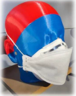

# ADF-mask
Flat-folding facepiece respirator
This file shows a prototyped model of a three-panel flat-folding facepiece respirator.

 
 
A prototyped model of a three-panel flat-folding facepiece respirator is shown, where the three panels are named the nose panel, the front panel and the chin panel. The peripheral edge of nose and chin panels take the shape of a continuous curve.
